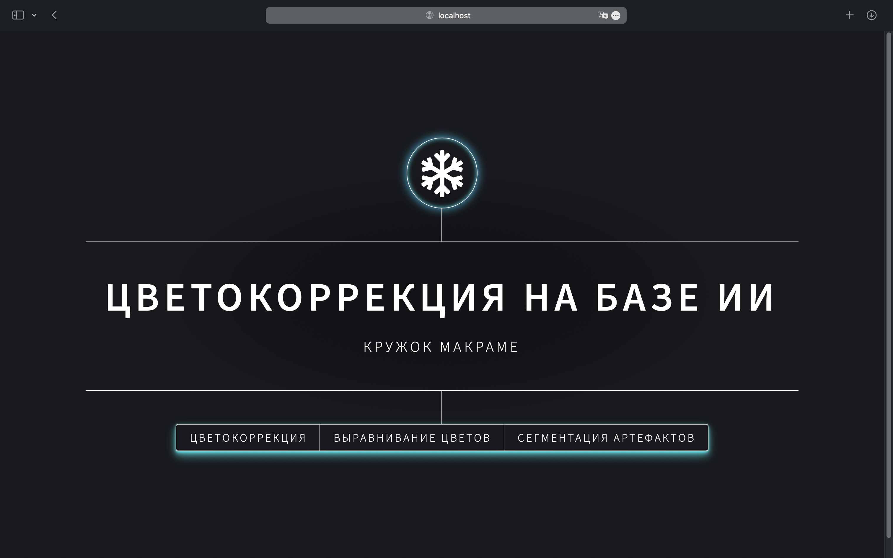
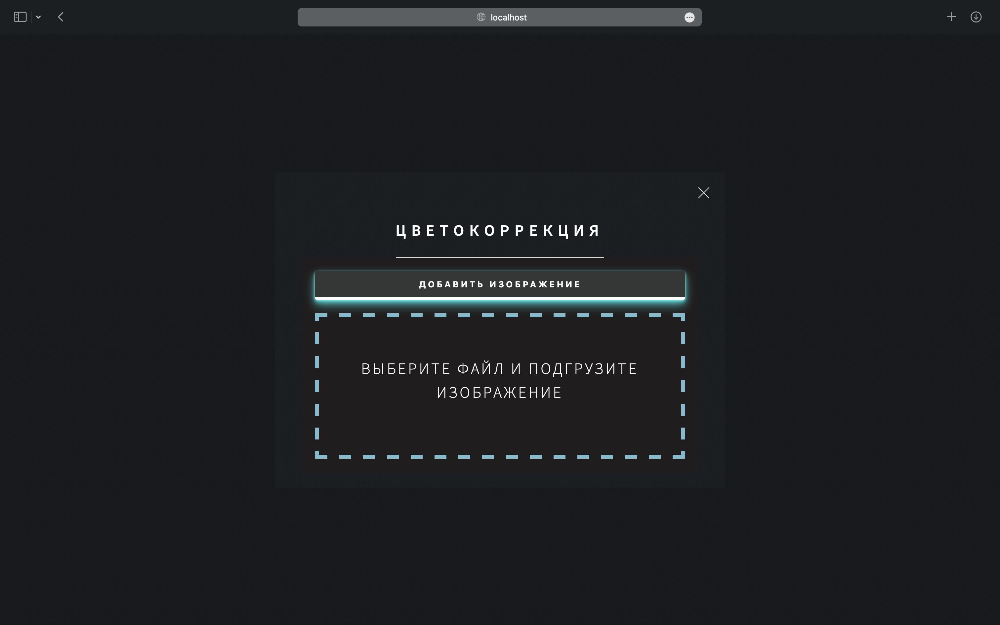

# XmasHack2023

## Установка

Проверка работоспособности проверялась на сервере [Selectel](https://selectel.ru)(__Собран с использованием OS Ubuntu 22.04 Machine learning, видеокарта А2, 100-150ГБ SSD__).

Для сборки проекта(запуска сервера) использовались:
- poetry - установка по [ссылке](https://python-poetry.org/docs/#installing-with-the-official-installer);
- docker, docker-compose
- triton
- __Расчитывается на cuda 11.8__, иначе сборка тритон-сервера может не обнаружить GPU.

### Настройка окружения

```bash
# Для корректности установок связности для torch-cuda лучше обновить пакетные зависимости
poetry update torch
poetry install
```

### Настройка сервера для инференса

```bash
# Для запуска сервера на triton необходимо
cd backend/nvidia-triton
docker-compose build
docker-compose up
```

После этого должен запуститься сервер, и если нет ошибок вида `error 1`, а видно следующий вывод:
```bash
Started GRPCInferenceService at 0.0.0.0:8001
Started HTTPService at 0.0.0.0:8000
Started Metrics Service at 0.0.0.0:8002
```

значит сервер работает, можно оставить его в выделенном окне в `tmux`.

### Запуск

Для запуска необходимо

```bash
cd frontend
poetry run python3 app.py
```

Должно отобразиться 
```bash
 * Serving Flask app 'app'
 * Debug mode: on
WARNING: This is a development server. Do not use it in a production deployment. Use a production WSGI server instead.
 * Running on all addresses (0.0.0.0)
 * Running on http://127.0.0.1:5000
 * Running on http://192.168.0.2:5000
Press CTRL+C to quit
 * Restarting with stat
 * Debugger is active!
 * Debugger PIN: 109-172-851
```

Теперь к сервису можно приходить по адресу `localhost:5000` или `public_ip:5000`, если сервер имеет доступ в общий интернет.

# Пример экранов

Так выглядит предлагаемый сервис



